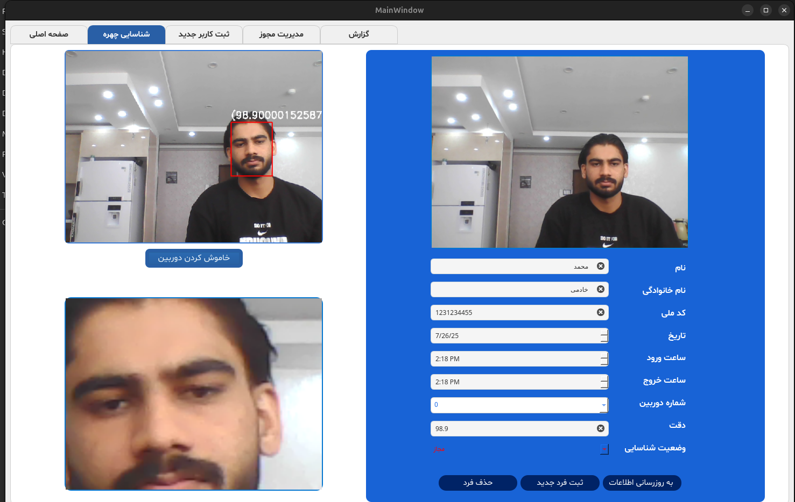

<h1 style="text-align: center;">FacePresenceAI</h1>

# Face Recognition system with Python,PyQt5 and PostgreSQL

A smart AI-powered face recognition and attendance management system designed for security and monitoring applications. It uses:

- **YOLOv8n**: For person detection.
- **YuNet**: For face detection.
- **SFace**: For face recognition.
- **PyQt5**: For the GUI.
- **PostgreSQL**: For storing face encodings and user data.

## Features
- **Real-Time Detection**: Identifies faces in front of cameras (supports 2 cameras: 0 and 1) and matches them with a database.
- **Attendance Management**: Logs entry/exit times, duration, and status (recognized or unrecognized).
- **New User Registration**: Allows adding unrecognized individuals to the database.
- **Permissions and Reports**: Enables defining new permissions and generating attendance reports with filters.
- **Applications**: Ideal for secure access control, automated attendance, and traffic monitoring without cards or fingerprints.
- Utilizes YOLOv8n to count multiple individuals in the camera's view simultaneously.

## Example Output
Check out the updated GUI and database integration in action:

- [GUI Demo Video](https://drive.google.com/drive/folders/1YZvPkcBZ1do0OaA5cNz9qdNeBaqf7XeZ?usp=drive_link)

## Database Schema
The database includes tables for Persons, Access Logs, Permissions, Cameras, and Report Exports. See the schema diagram below for details:

## Screenshots
- **Attendance Management**: Displays a table of logs with time and status filters.
  
  
  
- **Report Page**: Features a calendar and list of exported reports.
  
  
  
- **User Entry**: Form for registering new users with camera preview.

  
  
- **Face Detection**: Green bounding box around detected faces with status display.
  
  
  
- **User Info**: Shows user details post-recognition, including pop-up info.
  
  
  
 - **Count Persons**: shows count of people in front of camera.
   
  
  
  
  ## Installation & Setup
1. **Prerequisites**:
   - Python 3.8+
   - PostgreSQL (create tables using the script in `db/database_setup.txt`).
   - Install dependencies: `pip install -r requirements.txt`
   - OpenCV with ONNX support
   - PyQt5
   - Anaconda (recommended)

2. **Download Models**: Download ONNX models (e.g., `face_detection_yunet_2023mar.onnx`, `face_recognition_sface_2021dec.onnx`) from the link below and place them in the `models/` folder.
   [Model Files](https://drive.google.com/drive/folders/137YUftclmLGNRhAEz-L8bCpmbqxM8-2E?usp=drive_link)

3. **Run**: `python main_app`

## Demo
Check out demo videos (e.g., `detect_persons_YOLO.webm`, `recognize_face.webm`) showcasing the system in action:
[Demo Videos](https://drive.google.com/drive/folders/1YZvPkcBZ1do0OaA5cNz9qdNeBaqf7XeZ?usp=drive_link)

## License
MIT License – Free to use and modify.

## Acknowledgments
- YuNet for face detection.
- SFace for face recognition.
- PyQt5 for GUI.
- PostgreSQL for database management.

## Contact
For questions, reach out to me at: [elnazparsaei1994@gmail.com](mailto:elnazparsaei1994@gmail.com) or [LinkedIn](https://linkedin.com/in/elnazparsaei).
